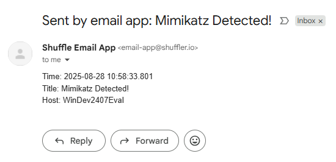

# soc-automation-lab
An end-to-end security automation lab showcasing threat detection, incident response, and SOAR capabilities.
# Home Lab: A Modern SOC Automation Project

This project showcases the full lifecycle of a modern Security Operations Center (SOC), from endpoint telemetry and threat detection to automated incident response and case management. My home lab architecture is centered around a client-server model, with a virtualized endpoint and cloud-hosted server components. This design ensures flexibility, scalability, and security while demonstrating a practical understanding of a modern security stack.

* **Client Endpoint**: A Windows 11 virtual machine that simulates a user workstation, configured to generate detailed security telemetry.
* **Cloud Infrastructure**: Two dedicated virtual servers (droplets) hosted on DigitalOcean for the SOC platforms.
* **Security Stack**: An integrated suite of open-source tools that work in tandem to detect threats, manage cases, and automate responses.

Below is a high-level architectural diagram of the lab, illustrating the flow of data from the client endpoint to the various cloud-based security platforms. 

---

## Technologies Used

* **Virtualization**: VirtualBox for local machine hosting and DigitalOcean for cloud-based server infrastructure. I chose DigitalOcean for its simplicity and affordability, which is ideal for a personal lab environment.
* **Operating Systems**: Windows 11 (Client) and Ubuntu (Servers).
* **SIEM**: **Wazuh** for collecting, analyzing, and correlating security data and generating alerts.
* **SOAR**: **Shuffle** for orchestrating and automating incident response workflows.
* **Case Management**: **TheHive** for collaborative incident investigation and case management.
* **Endpoint Telemetry**: **Sysmon** for generating advanced event logs on the Windows 11 client. I chose Sysmon because it provides far more detailed and actionable event data than the default Windows logs, which is crucial for effective threat hunting.

---

## Project Build Log (In Progress)

This section details the steps I took to build and configure the lab to its current state.

### Phase 1: Client Endpoint Configuration

1.  **Windows 11 Setup**: I set up a virtual machine running Windows 11 using VirtualBox.
2.  **Sysmon Installation**: I installed the Sysmon tool with a comprehensive configuration file (`sysmonconfig.xml`) via an elevated command prompt. This enables the detailed logging of system activities, which are visible in the Windows Event Viewer.

### Phase 2: Wazuh Server Deployment

1.  **DigitalOcean Droplet**: I created a new Ubuntu droplet named `wazuh` on DigitalOcean to host the Wazuh SIEM platform.
2.  **Firewall Configuration**: I applied strict inbound firewall rules to the droplet, restricting all TCP and UDP traffic to only my public IP address. This critical security measure prevents unauthorized access and protects the environment.
3.  **SSH Access**: I connected to the new droplet via SSH using the terminal on my host machine, authenticating with the root user and the assigned password.
4.  **System Preparation**: I performed system updates and upgrades using `apt-get update && apt-get upgrade -y` to ensure all packages were up to date before installation.
5.  **Wazuh Installation**: I installed the Wazuh platform using a `curl` command to download and execute the official installation script.
6.  **Dashboard Access**: I saved the credentials provided upon installation and successfully accessed the Wazuh dashboard via a web browser at `https://<Wazuh Droplet IP>`.

### Phase 3: TheHive Server Deployment

1.  **DigitalOcean Droplet**: I created a second Ubuntu droplet named `thehive` on DigitalOcean.
2.  **Firewall Integration**: This new droplet was added to the same firewall ruleset that protects the Wazuh server, ensuring consistent security across the cloud infrastructure.
3.  **SSH Access**: I established a new SSH connection to the `thehive` droplet to begin the configuration process.
4.  **Prerequisites Installation**: I installed the necessary prerequisite components—Java, Cassandra, and Elasticsearch—before proceeding with TheHive's core installation.

### Phase 4: Core Services Configuration & Agent Connection

1.  **Cassandra Configuration**:
    * I edited the `cassandra.yaml` file (`nano /etc/cassandra/cassandra.yaml`) to set a custom cluster name.
    * I updated the `listen_address` and `rpc_address` fields to the public IP address of TheHive droplet.
    * I set the `seeds` address to the public IP of the droplet (`<TheHive Public IP>:7000`).
    * I restarted the service (`systemctl stop cassandra.service`), removed old data files (`rm -rf /var/lib/cassandra/*`), and then started the service again (`systemctl start cassandra.service`).

2.  **Elasticsearch Configuration**:
    * I edited the `elasticsearch.yml` file (`nano /etc/elasticsearch/elasticsearch.yml`) to configure Elasticsearch.
    * I set the `cluster.name` to `thehive`.
    * I specified the `network.host` to the public IP of TheHive droplet.
    * I configured `cluster.initial_master_nodes` to include only the current node.
    * I started and enabled the Elasticsearch service to ensure it runs on boot.

3.  **TheHive Configuration**:
    * I ensured the `thehive` user and group had the correct file permissions on the `/opt/thp` directory using `chown -R thehive:thehive /opt/thp`.
    * I edited the `application.conf` file (`nano /etc/thehive/application.conf`).
    * I updated the `hostname` and `application.baseurl` fields to the public IP of TheHive droplet.
    * I set the `cluster-name` to match the Cassandra cluster name.
    * I started and enabled TheHive service.
    * I corrected a login issue by adding `-Dlog4j2.formatMsgNoLookups=true -Xms4g -Xmx4g` to the JVM options file (`nano /etc/elasticsearch/jvm.options.d/jvm.options`) to limit Java's memory allocation.
    * I successfully logged into the TheHive dashboard via `https://<TheHive Droplet IP>:9000`.

4.  **Wazuh Agent Deployment**:
    * From the Wazuh dashboard, I selected "Add agent" and chose Windows as the operating system.
    * I provided the public IP of the Wazuh droplet as the server address.
    * I copied the generated agent installation command and ran it with administrative privileges in PowerShell on the Windows 11 VM.
    * I started the Wazuh agent service (`net start wazuhsvc`).
    * I verified the agent's status as "**Active**" in the Wazuh dashboard and confirmed that security events were being successfully queried.

      

### Phase 5: Telemetry Ingestion and Custom Rule Creation

1.  **Wazuh Agent Configuration**:
    * I edited the `ossec.conf` file on the Windows 11 VM (`C:\Program Files (x86)\ossec-agent\ossec.conf`) to remove the default security and system log collection and instead focus on collecting Sysmon logs.
    * I restarted the Wazuh agent service (`net start wazuhsvc`) to apply the new configuration.

2.  **Telemetry Collection & Verification**:
    * I downloaded and executed the Mimikatz red team tool on the Windows 11 VM using an elevated PowerShell.
    * I observed that the event **was not immediately logged** in Wazuh's security events.
    * I enabled log archiving on the Wazuh server by changing the `logall` and `logall-json` settings to `yes` in `ossec.conf` (`nano /var/ossec/etc/ossec.conf`).
    * I configured Filebeat to forward the archived logs by setting `archives.enabled: true` in `filebeat.yml` (`nano /etc/filebeat/filebeat.yml`).
    * I restarted the Wazuh and Filebeat services.
    * I created a new index pattern `wazuh-archives*` in Wazuh's Stack Management to index the archived logs.
    * I confirmed that the Mimikatz event was **now logged and viewable** by searching for it in the Wazuh archives on the command line (`cat archives.json | grep -i mimikatz`) and in the Wazuh dashboard.

3.  **Custom Rule Creation**:
    * I identified a stable log field, `originalFileName`, to craft a custom detection rule. This ensures that the rule will not be bypassed even if an attacker renames the Mimikatz executable, a common evasion tactic.
    * I created a custom rule in the `local_rules.xml` file within Wazuh's **Management -> Rules** section. This rule is designed to trigger an alert whenever Mimikatz is detected, regardless of the file's name.

      

### Phase 6: SOAR Integration with Shuffle

1.  **Shuffle Workflow Setup**:
    * I created a new workflow in the Shuffle web interface.
    * I added a **Webhook** as the trigger, naming it `Wazuh_Alerts`.

      

    * I copied the unique Webhook URL to use for integration.
    * I ran the Mimikatz executable again on the Windows 11 VM to test the webhook, confirming the alert was successfully received by Shuffle.

1.  **Wazuh Integration**:
    * I added a new integration to Wazuh's `ossec.conf` file (`nano /var/ossec/etc/ossec.conf`).
    * I configured the integration to send alerts to the `Wazuh_Alerts` Webhook URL copied from Shuffle.
    * I specified the `rule_id` for the Mimikatz rule to ensure only specific alerts are forwarded to the SOAR platform.

2.  **Enrichment with VirusTotal**:
    * I added a **Regex Capture Group** action to the Shuffle workflow to extract the SHA256 hash from the Mimikatz alert data. The input data was set to `execution hashes` with a specific regex pattern to capture the hash value.
    * I tested the action and successfully parsed the SHA256 hash.
    * I obtained an API key from VirusTotal.
    * I added a **VirusTotal** action to the workflow, configured to "Get a hash report."
    * I provided the API key and set the ID to the captured hash value (`$sha256.group_0.#`).
    * I ran the workflow, confirming that the hash was sent to VirusTotal and the reputation report (which correctly identified it as Mimikatz) was received in Shuffle.

3.  **Automated Alert Creation in TheHive**:
    * I created a `Service` user and a `Normal` user in TheHive's GUI, with an API key generated for the Service user.
    * I allowed inbound traffic on port 9000 for TheHive's public IP in the DigitalOcean firewall.
    * In Shuffle, I added a **TheHive** action to the workflow.
    * I authenticated with the API key and TheHive's public IP/port (`https://<TheHive Public IP>:9000`).
    * I configured the **Create alert** action to map relevant fields from the Wazuh alert, such as `Title`, `Tags`, `Description`, `Tlp`, `Severity`, `Type`, `Status`, `Source`, `Sourceref`, and `Pap` (which includes user, process ID, command line, and computer information).
    * I successfully tested the workflow, which created a new alert in TheHive GUI with all the specified details.

      

4.  **SOC Analyst Email Notification**:
    * I added an **Email** action to the Shuffle workflow, connected to the VirusTotal action.
    * I configured the recipient email and set the subject to `Mimikatz Detected!`.
    * I used dynamic data to populate the email body with key details such as `Time`, `Title`, and `Host`.
    * I successfully tested and received a confirmation email, notifying the analyst of the new alert.

      

### Phase 7: Active Response Setup

1.  **Firewall & Communication Setup**:
    * I enabled inbound TCP traffic on port 55000 (Wazuh API) and port 1514 on the Wazuh manager terminal to allow API communication.
    * On the victim machine (Win 11 VM), I configured firewall rules to allow SSH on port 22 only from my host's public IP and deny all other connections.

2.  **Wazuh Active Response Configuration**:
    * I obtained a JWT token from the Wazuh API for authentication.
    * In Wazuh's `ossec.conf` file (`/var/ossec/etc/ossec.conf`), I configured an active response command.
    * I created the command named `firewall-drop` with a local location, level 5, and no timeout.
    * I restarted the Wazuh manager service.
    * I verified that the active response script was properly registered using `agent_control -L`.

      

3.  **Shuffle Active Response Workflow**:
    * I added a **Wazuh** application to the Shuffle workflow.
    * I configured the action to run a command.
    * I provided the Wazuh manager's public IP and port, and the API key.
    * I specified the agent ID (`002` in this case) and set `wait for complete` to `true`.
    * For the command, I used the command named `firewall-drop0`, and for the arguments, I used a test IP address like `8.8.8.8`.
    * This final step demonstrates the ability to execute commands on the client endpoint, allowing for an automated response, such as dynamically blocking a malicious source IP.

---

## Challenges and Solutions

During this project, I encountered a few challenges that required me to troubleshoot and find solutions, which is a critical part of a security professional's job.

* **TheHive Login Issue**: After initial setup, I was unable to log into TheHive's dashboard. By checking the service logs, I discovered that the Java process was running out of memory. I resolved this by adding specific memory allocation parameters to the JVM options file (`-Xms4g -Xmx4g`), which fixed the issue. This experience highlighted the importance of carefully reviewing service logs and configuration files during deployment.
* **Wazuh Log Ingestion**: When I initially ran the Mimikatz executable, the events were not immediately visible in the Wazuh dashboard. I discovered that Wazuh's default configuration does not archive all events. To fix this, I enabled log archiving on the Wazuh server and configured Filebeat to forward these logs to Elasticsearch. This experience taught me the importance of understanding the data pipeline from the endpoint to the SIEM to ensure all relevant telemetry is being ingested and indexed.

---

## Project Summary & Accomplishments

This project successfully establishes a complete, operational SOC automation lab from the ground up. The architecture integrates open-source platforms to create a cohesive workflow that demonstrates my expertise in:

* **System Deployment**: Successfully deployed and configured multiple interdependent services (**Wazuh**, **TheHive**, **Shuffle**, **Elasticsearch**, **Cassandra**) on a cloud-based infrastructure.
* **Endpoint Security**: Configured and managed **Sysmon** on a Windows client to provide detailed security telemetry.
* **Threat Detection**: Implemented custom detection rules in **Wazuh** to accurately identify a known red-team tool (**Mimikatz**), even with basic evasion attempts.
* **Security Automation (SOAR)**: Built a robust automation pipeline using **Shuffle** to ingest alerts, enrich data with external intelligence (**VirusTotal**), create and manage cases in **TheHive**, and notify a SOC analyst via email.
* **Active Response**: Developed an automated active response capability using the **Wazuh** API to execute commands on the client, such as dynamically blocking a malicious IP address.

This lab serves as a comprehensive demonstration of my skills in security engineering, system administration, and incident response automation.
